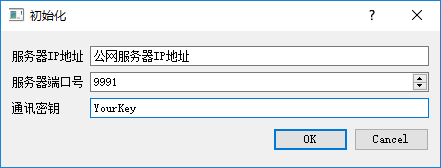

#NatTunnel是什么？可以用来干什么？
    NatTunnel·Server+Client是一套独立的公网辅助内网穿透软件。
    把NatTunnel·Server放置在一台公网服务器上，各个NatTunnel·Client可以互相建立p2p连接，连接成功后，可以添加Tcp端口转发。
    
#编译
    需要Qt4或5，至少需要vs2008环境。Linux下理论上也可以用，不过有些功能支持得不如Windows好。
    
#配置Server环境
    把编译出的Server.exe和Client.exe放在单独目录下，Qt相关dll也放在同一目录，需要哪些库下面有说明。
    创建一个文件，命名为NatTunnelServer.ini，输入以下内容：

    [Other]
    GlobalKey=YourKey       传输密钥，自行设置，所有连接到这个Server的Client都必须设置相同的密钥

    [Port]                  Server需要1个Tcp端口用于维持长连接，2个Udp端口用于功能支持
    Tcp=9991
    Udp1=9992
    Udp2=9993

    [Binary]
    Windows=Client.exe      把Client.exe放在目录下，这里填上文件名，用于版本检查，如果Client版本不对，Server会把正确的exe文件传过去，然后自动更新

#配置Client环境
    把Client.exe和Qt相关dll放在同一目录即可。
    
#依赖库
    Server：QtCore、QtNetwork、QtSql，还需要sqldrivers/qsqlite.dll
    Client：QtCore、QtGui、QtWidgets(Qt5需要)、QtNetwork、QtXml。可能需要bearer/qgenericbearer4.dll和bearerqnativewifibearer4.dll，这两个不是很确定。
    
###运行Server
###运行Client，第一次运行会要求输入Server信息：

###填入Server端对应信息后，输入一个自己的用户名：

###登录成功后如图：

    首次登录会随机产生一个本地密码，其他Client连接的时候需要验证本地密码。
    注意：Client关闭后生成的NatTunnelClient.ini中包含了本机唯一标识符，也在第一次运行时随机产生，如果删除了，就会被识别成不同的Client。
    
